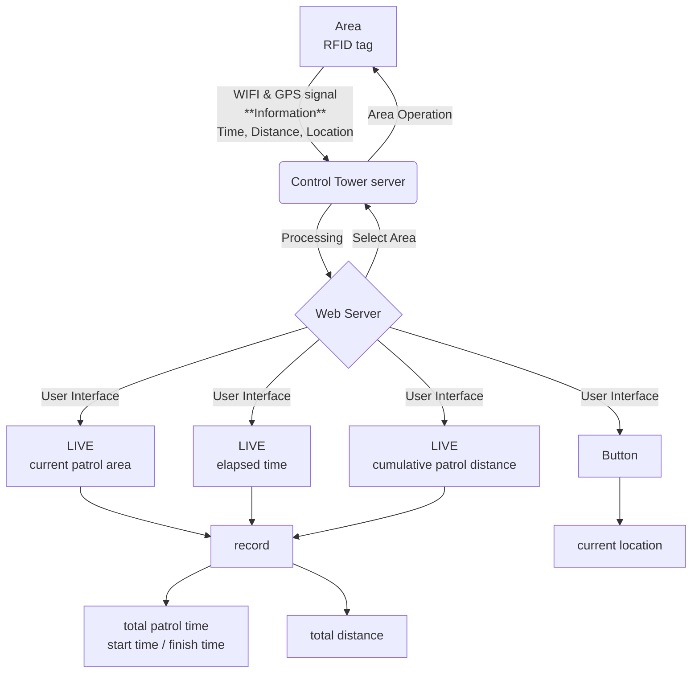

# 기능 명세서

### LIVE
* 현재 순찰 중인 구역
* 현재 구역에서 순찰을 시작한 지 얼마나 되었는지(누적 시간)
* 현재 구역에서 몇 미터 순찰을 했는지(누적 거리)
* 현재 순찰 중인 위치(구역 내 위치 확인)

### 기록
* 순찰을 완료한 구역에서의 총 순찰 시간
  * 순찰 시작 시간
  * 순찰 종료 시간
* 순찰을 완료한 구역에서의 총 순찰 거리

### 구역 컨트롤
* 특정 구역 선택(클릭)시 해당 구역 불빛 세기 UP / DOWN
  * 버튼 형식 or 지도 모양 따온 후 주변 영역 선택 시 클릭으로 취급??

# Controller Tower Flow
